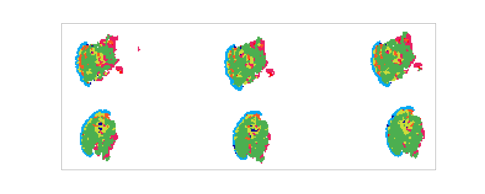
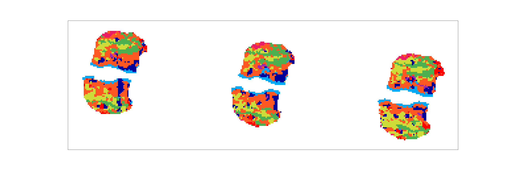
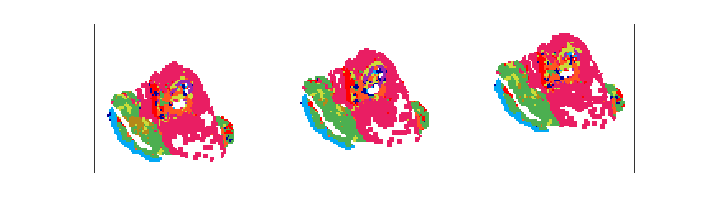

# Skin inflammatory pattern recognition project

## Project Architecture
```
# Project root
   |----tensorflow training
   |      |----train.py
   |      |----skin_model
   |               |----config.py        # config node file
   |               |----augment.py       # augmentation
   |               |----contour_util.py  # draw contour for nuclear segmentation
   |               |----customized_show_result.py  # draw contour for nuclear segmentation
   |               |----dataloader.py    # tensorflow version dataloader 
   |               |----eval.py          # inference tools, containing inference runner
   |               |----model.py         # resnet modules
   |               |----util.py          # common utility functions
   |
   |----bbox                             # prefetched bbox for training
   |
   |----label/label.py                   # fetch labels from AetherSlide website
   |
   |----first stage inference pipeline
   |      |----inference.py              # pytorch inference program
   |      |----tf_inference.py           # tensorflow inference program
   |      |----result/                   # inference result
   |      |----recolor.py                # recolor inference slides(not used on newer version of AetherSlide)
   |      |----postdb.py                 # send inference result to AetherSlide database
   |      |----pipeline_recolor.sh       # automatic recolor pipeline
   |
   |----Second stage pattern recognizer by binary decision tree
   |      |----decision_tree/
   |
   |----Pytorch training
   |       |----train_pytorch.py
   |       |----train_all_cross_valid    # parallelized cross validation model by splitting training slides
   |       |----pytorch_model
   |               |----config.py        # config node file
   |               |----dataloader.py    # tensorflow version dataloader 
   |               |----model_zoo.py     # resnet, efficientnet, SE-resnet modules
   |               |----util.py          # common utility functions
   |               |----loss.py          # loss functions, metrics
   |               |----pipeline.py      # train, validation, test pipelines
   |               |----runner.py        # inference runner, inference dataloader
   |
   |----Nuclear segmentation
   |        |----roi/                    # nuclear segmentation by MMDedection model(source code from other project)
   |        |----roi_result/             # inference result from pretrained MMDetection model
   |        |----contour.py              # display contour on images
   | 
```

## Data summary
Our training data are from NCKU department of dermatology. There are 40 digital glasses slides of different inflammatory patterns, with 15 of them labelled with contours of 10 kinds of major histological tissue. The goal of this study is to use a two-staged model to classify the inflammatory pattern of digital dermatopathological slides. The first stage involves a patch-based feature extraction network trained from ResNet101, and the second stage we use human designed feature extraction criteria and binary decision tree to classify inflammatory patterns.  

### Slide format
The digital slides are in `.ndpi` format, and we use openslide reader to fetch data from these ndpi files. 

### Labels 
In the first stage of our training pipeline, we classify every 512*512 patch to 10 common histology seen in dermatolopathology:
```
    [0, "Background"               ]
    [1, "Inflammatory_infiltration"]
    [2, "Adipose_tissue"           ]
    [3, "Sweat_gland"              ]
    [4, "Hair_follicles"           ] 
    [5, "Dermis"                   ]
    [6, "Sebaceous_gland"          ]
    [7, "Epidermis"                ]
    [8, "Skeletal_muscle"          ]
    [9, "Blood_vessel"             ]
```

Clinical doctors are requested to encircle contours containing only a king of these tissue from our AetherSlide viewer. The training patches are acquired by randomly select one bounding box whose center lies within the contour.  

In the second stage of our pipeline, the clinical doctors annotate the slide-level labels:
```
    superficial_perivascular inflammation
    superficial_and_deep_perivascular inflammation
    Periadnexal inflammation
    nodular inflammation
    diffuse inflammation
    vasculitis
    folliculitis
    septal_panniculitis
    lobular_panniculitis,
```

## Fetch contour result from research.aetherai.com
Simply go to `label/` directory and run
```
python3 label.py 
```

The latest contour result will be fetched from the AetherSlide website and stored in `label/label.json` file.

## Prefetch bounding box for training
You should customize the training/test/validation datasets and balance the classes, saving the bbox in path `bbox/`. Since the generation of bbox involves checking if a random point  lies in a polygon, requiring huge CPU consumption. the bbox information will be 
retreived directory from `bbox/`, saving a large amount of time for data loading.  


## Pytorch/Tensorflow Training
The training configs can be found in `torch_training/pytorch_model/config.py` or `tf_training/skin_model/config.py` , the config files are built in yacs config node format. To read the config, one can call **get_cfg_defaults()**.

Before training your model, please modify the config file as your customized needs.
```
    # tensorflow training
    cd tf_training/
    python3 train.py

    # pytorch training
    cd torch_training
    python3 train_pytorch.py
```

The result checkpoint files(in `.h5` format or `.pth`), accuracy/loss/AUC/precision/recall/f1 information will be stored in `./checkpoint/`.

## First stage inference
The inference pipeline are also written in both pytorch and tensorflow, which can be seen in `first_stage_inference/`. The inference configs are incorporated in the training configuration files `torch_training/pytorch_model/config.py` and `tf_training/skin_model/config.py`(see INFERENCE session in these files).

```
    python3 inference.py
    python3 tf_inferenc.py
```

The inference results will be saved in `first_stage_inference/inference_result/tf/` or `first_stage_inference/inference_result/torch/` respectively. A json format `SAVE_DIR/SLIDE_NAME/mapping.json` file will be generated by compressing the resultant probability map. The above is the heatmap after decompression (the data range is within 0~9, since there are 10 classes)  


One can also map the inference propability map to well-painted color images by 

```
    python recolor.py --root_dir first_stage_inference/inference_result/tf/ --result_dir first_stage_inference/inference_result/color_tf/
```






### Post database
Simply modify the arguments `--replace_source, --replace_target, -- result_dir, --usrname, --password` for postdb.py, one can sent the 
```
python3 postdb.py
```


## Second stage inference: Decision tree 
The decision tree in the second stage of the project is written in directory decision_tree/. Go to
the above directory and run

```
python3 decision_tree.py
```

the final decision tree is printed on screen. If one wants to store the algorithm tree, go back to
skin project root directory and run BDTlab.ipynb. 

# Skin inflammatory cell nuclear segmentation project
## Fetching region of interest(ROI)
The ROI information is stored in label/label.py, ROI is a class with ID=220, one can get the ROI patches
into the folder roi/ by running
```
python3 contour.py
```

## Inference by mmdetection
The mmdetection model will first predict the contours of images in roi/ folder, and the contour
results will be stored in folder roi_result/ .
